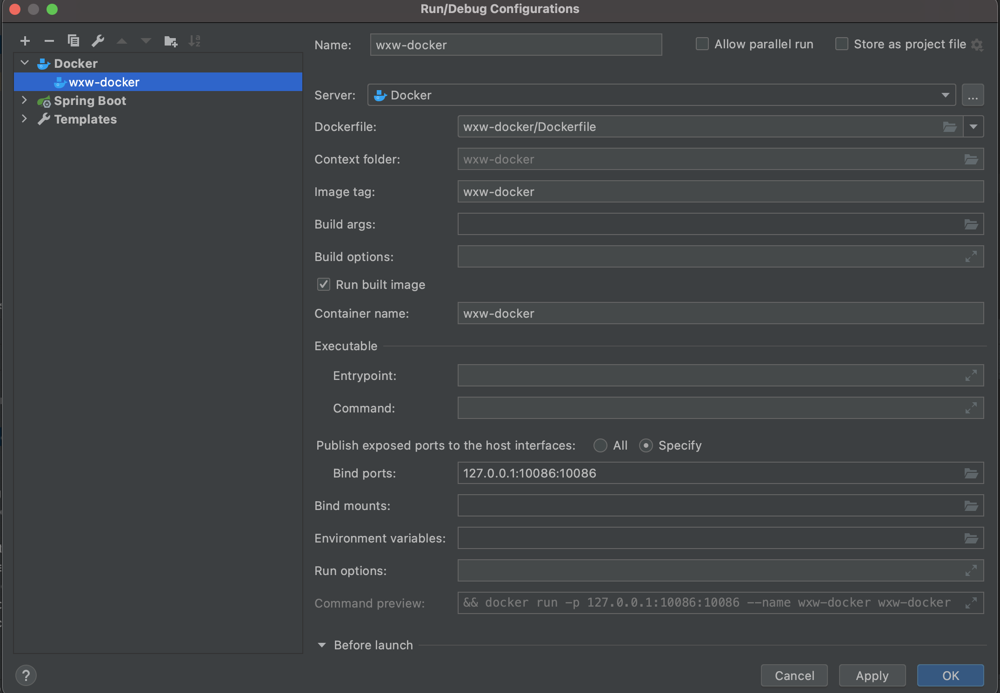
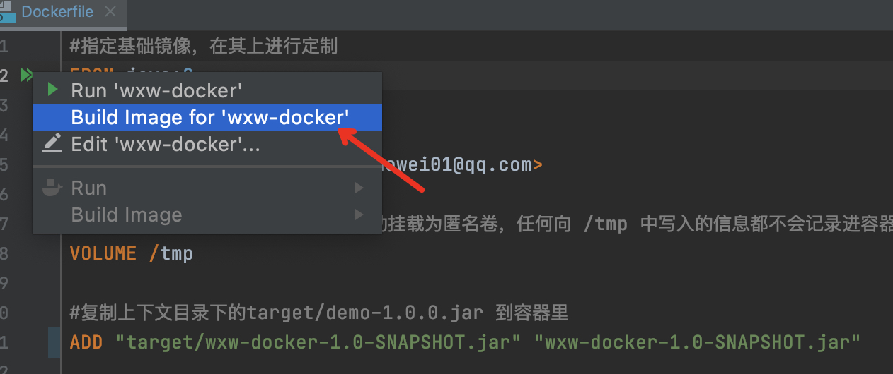
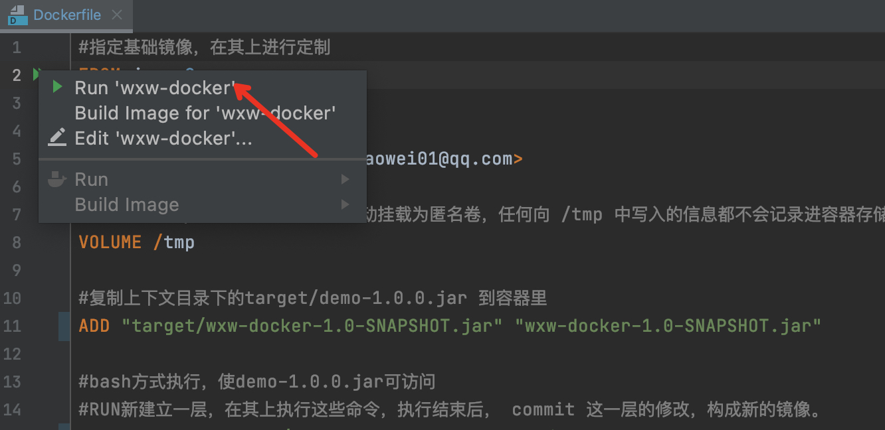
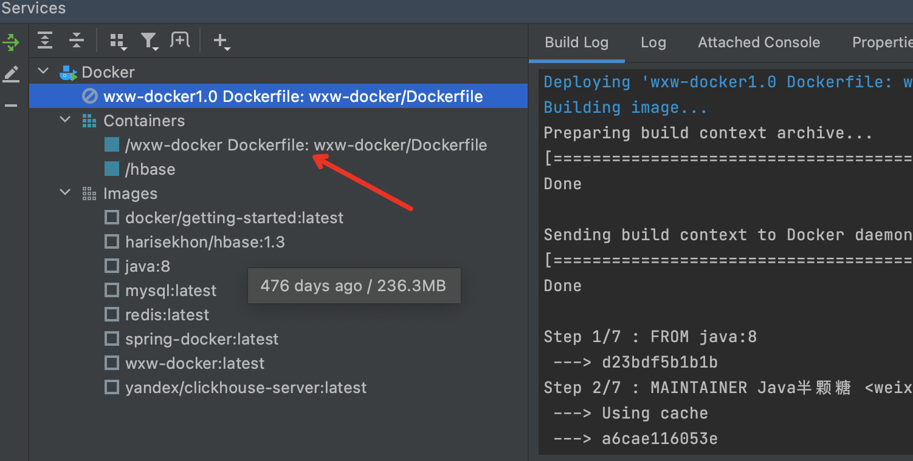
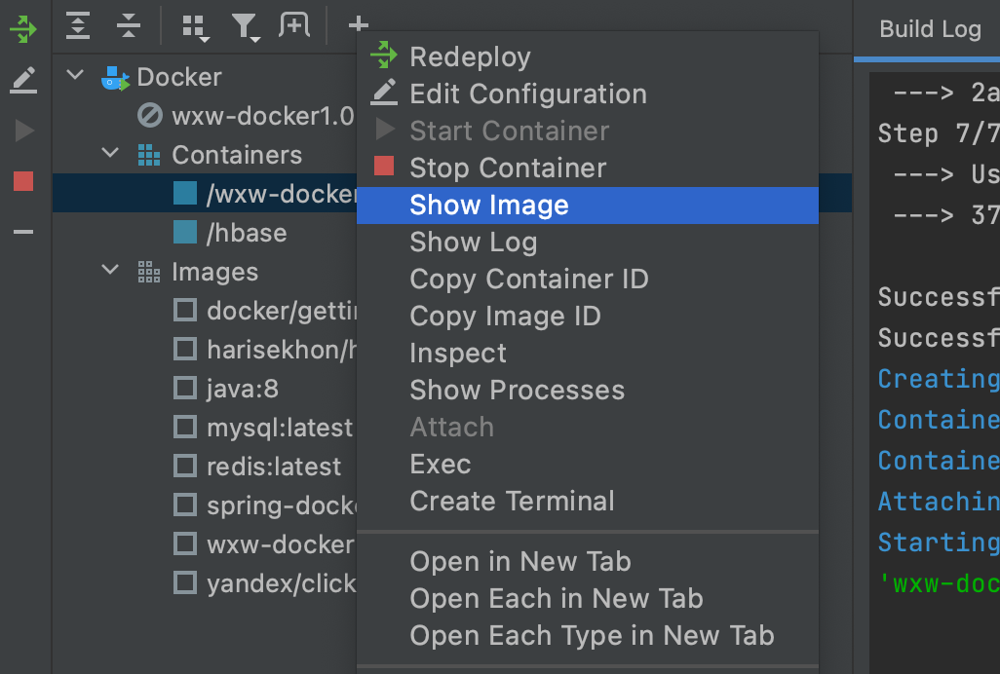
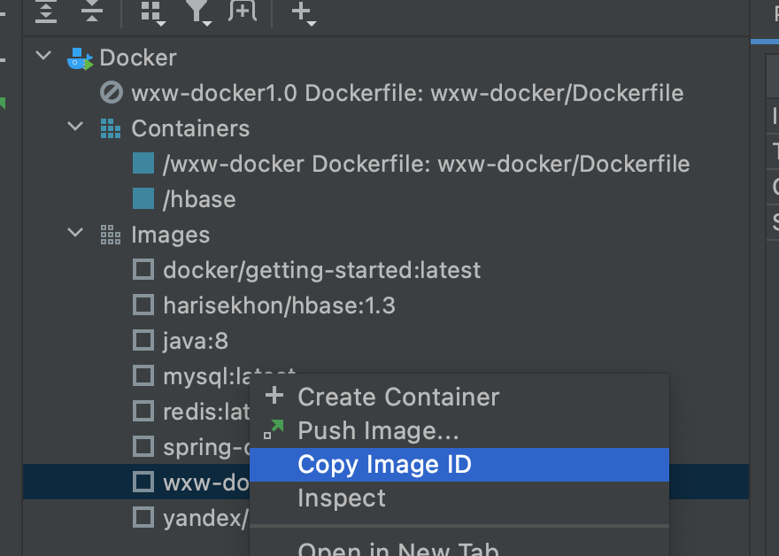
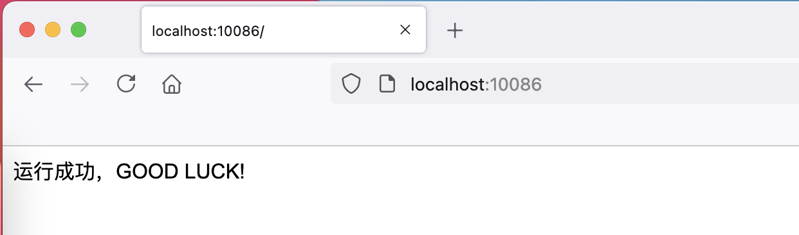

### wxw-docker


> springboot-docker 项目

**前提** 

1. 可以运行jar包的环境
2. 机器上已经安装了docker,idea有docker插件
3. 准备部署的springboot的jar包
4. Dockerfile文件

在我们持续集成过程中，项目工程一般使用 Maven 编译打包，然后生成镜像，通过镜像上线，能够大大提供上线效率，同时能够快速动态扩容，快速回滚，着实很方便。docker-maven-plugin 插件就是为了帮助我们在Maven工程中，通过简单的配置，自动生成镜像并推送到仓库中。

### 1. docker-maven-plugin 

这里我们要测试 Java Maven 项目用 docker-maven 插件打镜像，上传镜像等操作，所以需要先安装一下 Docker、Maven、Java，这里忽略安装过程，简而言之，此插件将maven和docker进行集成。

#### 1.1 配置 DOCKER_HOST

docker-maven-plugin 插件默认连接本地 Docker 地址为：localhost:2375，所以我们需要先设置下环境变量。

```bash
DOCKER_HOST=tcp://<host>:2375
```

**docker开启远程访问** 

```bash
[root@izwz9eftauv7x69f5jvi96z docker]# vim /usr/lib/systemd/system/docker.service
#修改ExecStart这行
ExecStart=/usr/bin/dockerd  -H tcp://0.0.0.0:2375  -H unix:///var/run/docker.sock
#重新加载配置文件
[root@izwz9eftauv7x69f5jvi96z docker]# systemctl daemon-reload    
#重启服务
[root@izwz9eftauv7x69f5jvi96z docker]# systemctl restart docker.service 
#查看端口是否开启
[root@izwz9eftauv7x69f5jvi96z docker]# netstat -nlpt
#直接curl看是否生效
[root@izwz9eftauv7x69f5jvi96z docker]# curl http://127.0.0.1:2375/info
```

#### 1.2 构建镜像

构建镜像可以使用一下两种方式

- 第一种是将构建信息指定到 POM 中
- 第二种是使用已存在的 Dockerfile 构建

其中，第一种方式，支持将 FROM, ENTRYPOINT, CMD, MAINTAINER 以及 ADD 信息配置在 POM 中，不需要使用 Dockerfile 配置。但是如果使用 VOLUME 或其他 Dockerfile 中的命令的时候，需要使用第二种方式，创建一个 Dockerfile，并在 POM 中配置 dockerDirectory 来指定路径即可。

**（1）指定构建信息到 POM 中构建** 

```xml
<build>
    <plugins>
        <plugin>
            <groupId>com.spotify</groupId>
            <artifactId>docker-maven-plugin</artifactId>
            <version>1.0.0</version>
            <configuration>
                <imageName>wxw-docker</imageName>
                <baseImage>java</baseImage>
                <maintainer>docker_maven weixiaowei@email.com</maintainer>
                <workdir>/ROOT</workdir>
                <cmd>["java", "-version"]</cmd>
                <entryPoint>["java", "-jar", "${project.build.finalName}.jar"]</entryPoint>
                <!-- 这里是复制 jar 包到 docker 容器指定目录配置 -->
                <resources>
                    <resource>
                        <targetPath>/ROOT</targetPath>
                        <directory>${project.build.directory}</directory>
                        <include>${project.build.finalName}.jar</include>
                    </resource>
                </resources>
            </configuration>
        </plugin>
    </plugins>
</build>
```

**（2）使用 Dockerfile 构建** 

```xml
    <!--插件管理-->
    <build>
        <plugins>
            <!--maven 插件管理-->
            <plugin>
                <groupId>org.springframework.boot</groupId>
                <artifactId>spring-boot-maven-plugin</artifactId>
                <version>2.3.3.RELEASE</version>
                <!--加入下面两项配置 父子聚合项目中需要将子包打包为jar包时使用-->
                <executions>
                    <execution>
                        <goals>
                            <!--重新打包-->
                            <goal>repackage</goal>
                        </goals>
                    </execution>
                </executions>
                <configuration>
                    <!--包含系统范围-->
                    <includeSystemScope>true</includeSystemScope>
                </configuration>
            </plugin>
            <!--docker 插件-->
            <plugin>
                <groupId>com.spotify</groupId>
                <artifactId>docker-maven-plugin</artifactId>
                <version>1.0.0</version>
                <configuration>
                    <imageName>${docker.image.prefix}/${project.artifactId}</imageName>
                    <!--dockerfile 文件所在目录-->
                    <dockerDirectory>/</dockerDirectory>
                    <!-- 这里是复制 jar 包到 docker 容器指定目录配置 -->
                    <resources>
                        <resource>
                            <targetPath>/</targetPath>
                            <directory>${project.build.directory}</directory>
                            <include>${project.build.finalName}.jar</include>
                        </resource>
                    </resources>
                </configuration>
            </plugin>
        </plugins>
    </build>
```

> ${basedir}/docker/Dockerfile 配置 

```dockerfile
#指定基础镜像，在其上进行定制
FROM java:8

#维护者信息
MAINTAINER Java半颗糖 <weixiaowei01@qq.com>

#这里的 /tmp 目录就会在运行时自动挂载为匿名卷，任何向 /tmp 中写入的信息都不会记录进容器存储层
VOLUME /tmp

#复制上下文目录下的target/demo-1.0.0.jar 到容器里
ADD "target/wxw-docker-1.0-SNAPSHOT.jar" "wxw-docker-1.0-SNAPSHOT.jar"

#bash方式执行，使demo-1.0.0.jar可访问
#RUN新建立一层，在其上执行这些命令，执行结束后， commit 这一层的修改，构成新的镜像。
RUN bash -c "touch /wxw-docker-1.0-SNAPSHOT.jar"

#声明运行时容器提供服务端口，这只是一个声明，在运行时并不会因为这个声明应用就会开启这个端口的服务
EXPOSE 10086

#指定容器启动程序及参数   <ENTRYPOINT> "<CMD>"
ENTRYPOINT ["java","-jar","wxw-docker-1.0-SNAPSHOT.jar"]
```

以上两种方式执行docker:build效果是一样的，执行输出过程大致如下：

```cmd
[INFO] --- docker-maven-plugin:1.0.0:build (default-cli) @ mavenDemo ---
[INFO] Building image mavendemo
Step 1/5 : FROM java
 ---> d23bdf5b1b1b
Step 2/5 : MAINTAINER docker_maven docker_maven@email.com
 ---> Using cache
 ---> 2faf180d4a50
Step 3/5 : WORKDIR /ROOT
 ---> Using cache
 ---> 862210f7956a
Step 4/5 : ENTRYPOINT java -jar mavenDemo.jar
 ---> Running in 96bbe83de6ec
 ---> c29009c88993
Removing intermediate container 96bbe83de6ec
Step 5/5 : CMD java -version
 ---> Running in f69b8d2a75b1
 ---> bc8d54014325
Removing intermediate container f69b8d2a75b1
Successfully built bc8d54014325

```

执行完成后，使用docker images查看生成的镜像：

```bash
REPOSITORY       TAG           IMAGE ID            CREATED             SIZE
mavendemo        latest        333b429536b2        38 minutes ago      643 MB
```

#### 1.3 命令构建镜像

```bash
# 只执行 build 操作
mvn clean package docker:build 

# 执行 build 完成后 push 镜像
mvn clean package docker:build -DpushImage 

# 执行 build 并 push 指定 tag 的镜像
mvn clean package docker:build -DpushImageTag

# 注意：这里必须指定至少一个 imageTag，它可以配置到 POM 中，也可以在命令行指定。命令行指定如下：
mvn clean package docker:build -DpushImageTags -DdockerImageTags=imageTag_1 -DdockerImageTags=imageTag_2

# POM 文件中指定配置如下：
<build>
  <plugins>
    ...
    <plugin>
      <configuration>
        ...
        <imageTags>
           <imageTag>imageTag_1</imageTag>
           <imageTag>imageTag_2</imageTag>
        </imageTags>
      </configuration>
    </plugin>
    ...
  </plugins>
</build>
```

相关文章

1. [dockerfile-maven-plugin极简教程](https://www.jb51.net/article/197299.htm) 

### 2. SpringBoot项目docker部署

> 导读：[Idea 打包项目实现Docker镜像部署服务器](https://blog.csdn.net/qq_41893274/article/details/108888343) 

#### 3.1 Docker 开启远程访问

```bash
[root@izwz9eftauv7x69f5jvi96z docker]# vim /usr/lib/systemd/system/docker.service
#修改ExecStart这行
ExecStart=/usr/bin/dockerd  -H tcp://0.0.0.0:2375  -H unix:///var/run/docker.sock
#重新加载配置文件
[root@izwz9eftauv7x69f5jvi96z docker]# systemctl daemon-reload    
#重启服务
[root@izwz9eftauv7x69f5jvi96z docker]# systemctl restart docker.service 
#查看端口是否开启
[root@izwz9eftauv7x69f5jvi96z docker]# netstat -nlpt
#直接curl看是否生效
[root@izwz9eftauv7x69f5jvi96z docker]# curl http://127.0.0.1:2375/info
```

- 本地容器不需要上面操作

#### 3.2 创建docker镜像

  

#### 3.3 执行镜像构建

 

运行日志：

```bash
Deploying 'wxw-docker1.0 Dockerfile: wxw-docker/Dockerfile'...
Building image...
Preparing build context archive...
[==================================================>]33/33 files
Done

Sending build context to Docker daemon...
[==================================================>] 29.77MB
Done

Step 1/7 : FROM java:8
 ---> d23bdf5b1b1b
Step 2/7 : MAINTAINER Java半颗糖 <weixiaowei01@qq.com>
 ---> Using cache
 ---> a6cae116053e
Step 3/7 : VOLUME /tmp
 ---> Using cache
 ---> 2e94fcb3a81b
Step 4/7 : ADD "target/wxw-docker-1.0-SNAPSHOT.jar" "wxw-docker-1.0-SNAPSHOT.jar"
 ---> Using cache
 ---> cd7ba97ccb31
Step 5/7 : RUN bash -c "touch /wxw-docker-1.0-SNAPSHOT.jar"
 ---> Using cache
 ---> e5bef705c194
Step 6/7 : EXPOSE 10086
 ---> Using cache
 ---> bc7574263f96
Step 7/7 : ENTRYPOINT ["java","-jar","wxw-docker-1.0-SNAPSHOT.jar"]
 ---> Using cache
 ---> f1b524b8e818

Successfully built f1b524b8e818
Successfully tagged wxw-docker1.0:latest
Creating container...
Container Id: 9abb071ad151cb50df2077bff906b38da9b3a3566076ad09629aaaf3e9cd4685

```

#### 3.4 通过镜像启动一个容器

通过dockerfile 运行dockerfile

 

运行后该目录下新增一个容器

 

容器相关操作：

 

#### 3.5 发布镜像

 

也可以直接用在docker客户端上直接执行：

```bash
docker run -p 28080:8080 --name wwx wuweixiang/demo:1.0

参数说明：
1.-d 后台运行
2.-p 28080:8080 将docker容器的8080端口映射到服务器上的28080端口
```

#### 3.6 客户端访问

 

相关文章

1. [Spring Boot Maven插件官方文档](https://docs.spring.io/spring-boot/docs/current/maven-plugin/reference/html/#introduction) 


